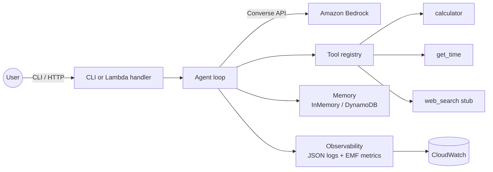

# Architecture

## Big picture



## Module map

```
src/agent/
├── agent.py            # the Converse API loop, tool-use orchestration
├── tools.py            # @tool decorator, registry, three sample tools
├── memory.py           # Memory ABC + InMemory + DynamoDB backends
├── observability.py    # JSON logger + EMF metric helpers
├── config.py           # env-based settings via pydantic-settings
├── cli.py              # typer CLI: `agent chat`
└── handler.py          # AWS Lambda handler for HTTP-fronted deployment
```

## The agent loop

A turn is:

1. **Fetch history** from memory.
2. **Build the Converse request** with the system prompt, history, and the registered tool specs.
3. **Call Bedrock**. Possible outcomes:
   - `end_turn` — assistant produced a final answer. Persist + return.
   - `tool_use` — assistant requested a tool. Execute it locally, append the tool result, loop.
   - `max_tokens` — defensive: surface a clear error.
4. **Cap the inner loop** at `MAX_TOOL_ROUNDS` (default 8) to prevent infinite tool-call loops.
5. **Emit telemetry** at every step.

The loop is implemented in `agent.run()` as a small, readable state machine — ~100 lines including comments.

## Tool registry

`@tool(description=...)` registers a function in a module-level registry and converts its signature into a JSON schema using Pydantic. The conversion is intentionally minimal — supported types: `str`, `int`, `float`, `bool`, `list[T]`, `dict[str, Any]`, optionals. Anything more exotic gets a clear runtime error.

The registry exposes `tool_specs()` (for the Converse API) and `dispatch(name, args)` (for execution). Both are pure functions of the registry state.

## Memory

Two backends. `InMemoryMemory` is a dict; `DynamoMemory` stores one item per `(session_id, ts)` with a TTL attribute. Both implement the same two-method interface. Production users typically subclass `Memory` for their own backend (Postgres, Valkey, etc.) — that is a single file.

## Observability

`observability.py` is the only place that knows what telemetry fields look like. Two helpers:

- `log_turn(level, **fields)` — writes a JSON line to stdout. CloudWatch ingests it as a structured log.
- `emit_emf(metric, value, unit, **dims)` — writes a CloudWatch EMF (Embedded Metric Format) line. No extra cost, no extra SDK.

If you want OpenTelemetry, replace `observability.py` — that is the only file you should touch.

## Why no LangChain / LangGraph / Strands

This starter prefers a small, readable agent loop over an abstraction layer. Reasons:

- The Converse API already gives you the cross-model uniformity that LangChain provides for plain completion calls.
- Debugging a 100-line loop is easier than debugging a graph framework.
- For genuinely complex orchestration (DAGs, parallel branches, durable execution), [arch 02](https://github.com/fernandofatech/aws-ai-reference-architectures/tree/main/architectures/02-multi-agent-orchestration) (Step Functions + Bedrock Agents) is the right level.

That said, the agent loop is small enough that swapping in LangGraph is a clean diff — `agent.py` is the only consumer.
