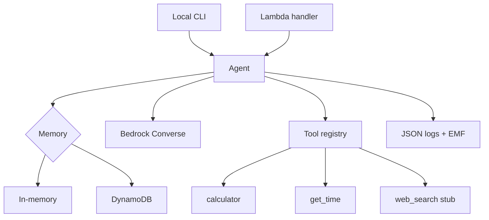

# Architecture

The agent is intentionally small: a Converse API loop, a tool registry, a memory interface, and observability helpers.

## Runtime flow

1. The client sends a user message and optional `session_id`.
2. The agent reads prior session memory.
3. Bedrock returns either a final answer or a tool-use request.
4. Tool requests are dispatched locally and returned to the model.
5. The final response, usage, tool calls, and latency are logged.
6. Recent conversation state is persisted.

## Boundaries

- The agent core knows about Bedrock's message shape, but not about API Gateway.
- Tools know their own integration details, but not the agent loop.
- Memory backends share a small interface so local and Lambda runtime stay aligned.
