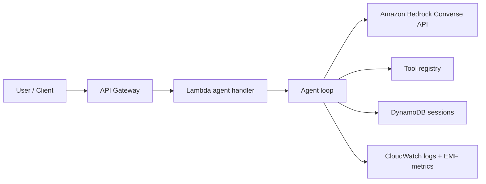

# bedrock-agent-starter

`bedrock-agent-starter` is a production-shaped template for building AI agents on Amazon Bedrock. It focuses on the parts that usually turn demos into real systems: tool use, memory, observability, tests, evals, Lambda deployment, and infrastructure as code.

## What is included

| Area | Included |
| --- | --- |
| Agent loop | Amazon Bedrock Converse API with multi-round tool use |
| Tools | Decorator-based registry with calculator, time, and search stub examples |
| Memory | In-memory backend for local development and DynamoDB backend for Lambda |
| Observability | JSON logs and CloudWatch EMF metrics |
| Deployment | Terraform skeleton for Lambda, API Gateway, DynamoDB, IAM, and logs |
| Quality | Ruff, mypy, pytest, GitHub Actions, PR template, issue templates |
| Evals | Golden-file regression tests for agent behavior |

## Design goals

- Keep the first run simple: clone, install, set AWS env vars, chat.
- Make production concerns visible without hiding everything behind a framework.
- Keep tools normal Python functions that are easy to test.
- Make architecture trade-offs explicit enough for a portfolio, a client review, or a real starter.

